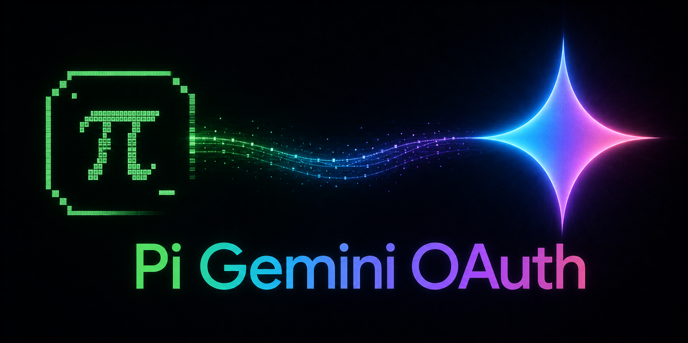

# Pi Gemini OAuth Extension



Restores Pi's removed `google-gemini-cli` OAuth provider as an installable Pi extension.

The provider ID is `google-gemini-cli`. Existing credentials stored for that provider are reused.

## Install

```bash
pi install git:github.com/thearyanag/pi-gemini-oauth-extension
```

Or try it for one run without installing:

```bash
pi -e git:github.com/thearyanag/pi-gemini-oauth-extension \
  --provider google-gemini-cli \
  --model gemini-2.5-flash \
  -p "Reply with exactly: ok"
```

## Login

If you do not already have `google-gemini-cli` credentials:

```bash
pi -e git:github.com/thearyanag/pi-gemini-oauth-extension
```

Then run:

```text
/login google-gemini-cli
```

For paid or Workspace Cloud Code Assist accounts, set one of:

```bash
export GOOGLE_CLOUD_PROJECT=your-project-id
export GOOGLE_CLOUD_PROJECT_ID=your-project-id
```

## Usage

```bash
pi --provider google-gemini-cli --model gemini-2.5-flash -p "Hello"
```

RPC mode:

```bash
pi --mode rpc \
  --provider google-gemini-cli \
  --model gemini-2.5-flash
```

## Models

- `gemini-2.0-flash`
- `gemini-2.5-flash`
- `gemini-2.5-pro`
- `gemini-3-flash-preview`
- `gemini-3-pro-preview`
- `gemini-3.1-flash-lite-preview`
- `gemini-3.1-pro-preview`

## Notes

- This extension targets Pi versions where `google-gemini-cli` is no longer built in.
- It uses the Google Cloud Code Assist OAuth flow and Cloud Code Assist streaming API.
- Tested against source Pi `0.75.3` with print mode and RPC mode.
