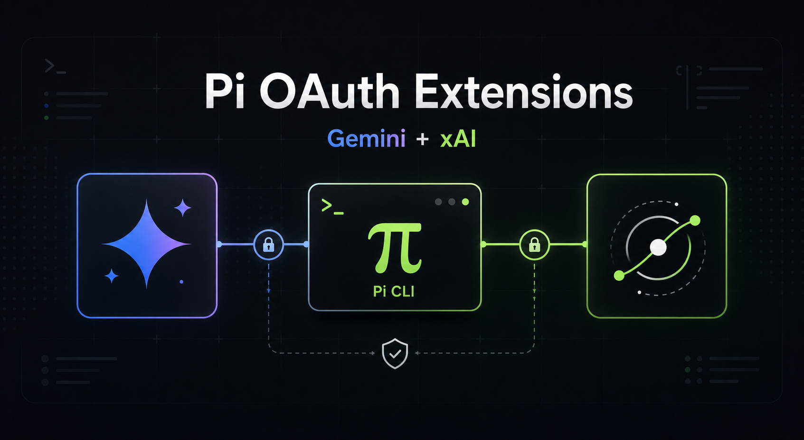

# Pi OAuth Extensions



Installable OAuth provider extensions for Pi.

Included providers:

- `google-gemini-cli` for Google Cloud Code Assist / Gemini CLI OAuth
- `xai` for xAI / Grok OAuth

## Install

```bash
pi install git:github.com/thearyanag/pi-gemini-oauth-extension
```

Or try it for one run without installing:

```bash
pi -e git:github.com/thearyanag/pi-gemini-oauth-extension \
  --provider google-gemini-cli \
  --model gemini-2.5-flash \
  -p "Reply with exactly: ok"
```

```bash
pi -e git:github.com/thearyanag/pi-gemini-oauth-extension \
  --provider xai \
  --model grok-4.5 \
  -p "Reply with exactly: ok"
```

## Login

Start Pi with the extension package loaded:

```bash
pi -e git:github.com/thearyanag/pi-gemini-oauth-extension
```

Then log in to either provider:

```text
/login google-gemini-cli
/login xai
```

For paid or Workspace Cloud Code Assist accounts, set one of:

```bash
export GOOGLE_CLOUD_PROJECT=your-project-id
export GOOGLE_CLOUD_PROJECT_ID=your-project-id
```

xAI login offers:

- Browser OAuth on `http://127.0.0.1:56121/callback`
- Device-code OAuth for SSH, Docker, VPS, or other headless environments

To force the device-code flow:

```bash
PI_XAI_OAUTH_FLOW=device-code pi -e git:github.com/thearyanag/pi-gemini-oauth-extension
```

## Usage

```bash
pi --provider google-gemini-cli --model gemini-2.5-flash -p "Hello"
```

```bash
pi --provider xai --model grok-4.5 --thinking low -p "Hello"
```

RPC mode:

```bash
pi --mode rpc \
  --provider google-gemini-cli \
  --model gemini-2.5-flash
```

```bash
pi --mode rpc \
  --provider xai \
  --model grok-4.5
```

## Gemini Models

- `gemini-2.0-flash`
- `gemini-2.5-flash`
- `gemini-2.5-pro`
- `gemini-3-flash-preview`
- `gemini-3-pro-preview`
- `gemini-3.1-flash-lite-preview`
- `gemini-3.1-pro-preview`

## xAI Models

- `grok-build-0.1`
- `grok-4.5`
- `grok-4.3`
- `grok-4.20-beta-latest-reasoning`
- `grok-4.20-beta-latest-non-reasoning`

## Notes

- This extension targets Pi versions where `google-gemini-cli` is no longer built in.
- It uses the Google Cloud Code Assist OAuth flow and Cloud Code Assist streaming API.
- xAI OAuth follows OpenClaw's Grok OAuth flow and uses xAI OIDC discovery, browser OAuth, refresh tokens, and device-code login.
- The xAI extension registers xAI models on the OpenAI Responses transport when loaded and can augment them from the live Grok OAuth model catalog after login.
- Tested against source Pi `0.75.3` with print mode and RPC mode.
